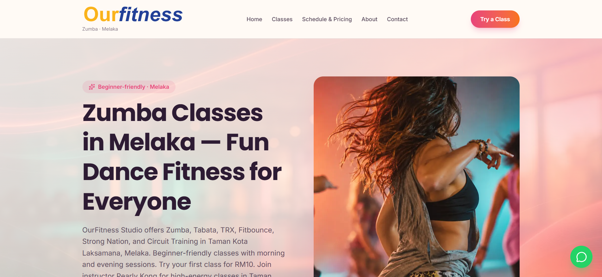
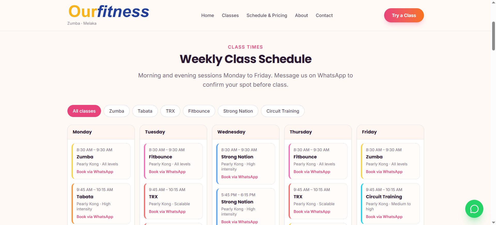
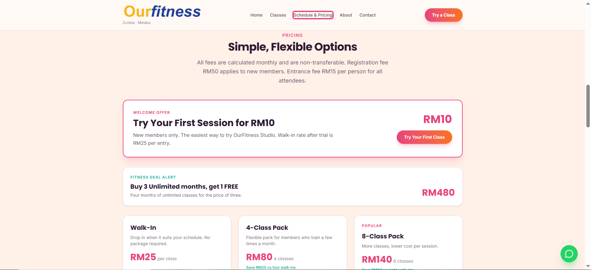
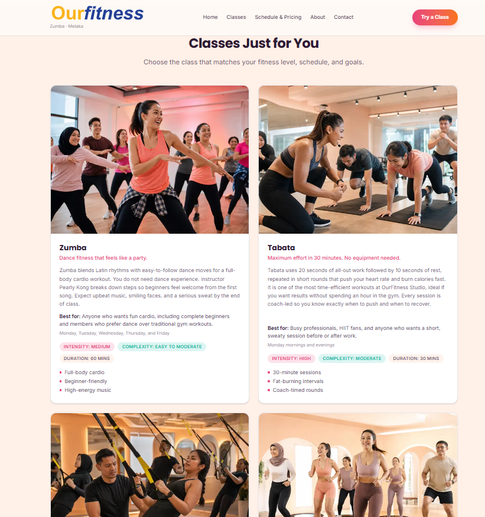
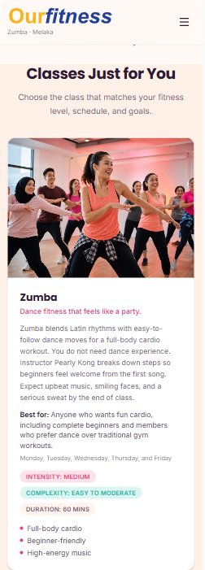

# Fitness Studio Marketing Website

[](https://nextjs.org/)
[](https://www.typescriptlang.org/)
[](https://tailwindcss.com/)

A conversion-optimized marketing website for a fitness studio, featuring advanced SEO/structured data implementation and content-driven architecture.



## Project Overview

Built for a fitness studio offering multiple class types (Zumba, HIIT, TRX, circuit training). The website focuses on conversion optimization, local SEO, and easy content management through a centralized TypeScript content system.

**Key Challenge:** Create a high-converting website with professional SEO that non-technical staff can easily update.

**Solution:** Content-driven architecture with AI-friendly structured data, interactive booking flow, and type-safe content management.

## Key Features

### AI & SEO Implementation
- **Schema.org Structured Data** — Comprehensive markup for HealthClub, Course, Event, Offer, FAQPage entities
- **AI Citability** — Content structured for LLM parsing (question-based headings, clear E-E-A-T signals)
- **Rich Results Ready** — Event schemas for recurring classes, Offer schemas with eligibility rules
- **Local Business Optimization** — Geographic targeting, business hours, pricing structured data

### Conversion-Focused Design
- **Interactive Schedule** — Filterable class calendar with direct WhatsApp booking
- **Tiered Pricing Display** — Value badges, savings calculations, trial offer highlight
- **Strategic CTAs** — WhatsApp integration with prefilled messages
- **Social Proof** — Testimonials, instructor credentials, beginner-friendly messaging

### Content Management System
- **Type-Safe Content** — All copy centralized in `content/*.ts` files
- **Zero Component Changes** — Content updates don't touch React components
- **Easy Handoff** — Non-developers can update text, prices, schedules

## Tech Stack

- **[Next.js 16.2](https://nextjs.org/)** — App Router, Server Components, automatic optimization
- **[TypeScript 5](https://www.typescriptlang.org/)** — Type safety for content and components
- **[Tailwind CSS 4](https://tailwindcss.com/)** — Utility-first styling
- **[Framer Motion 12](https://www.framer.com/motion/)** — Declarative animations
- **[Vercel](https://vercel.com/)** — Edge deployment, automatic previews

## Screenshots

<table>
  <tr>
    <td></td>
    <td></td>
  </tr>
  <tr>
    <td></td>
    <td></td>
  </tr>
</table>

## Quick Start

```bash
npm install
npm run dev
```

Open [http://localhost:3000](http://localhost:3000)

## Content Updates

All website content lives in `content/` folder:

- `content/site.ts` — Global config (name, address, hours, socials)
- `content/classes.ts` — Class descriptions and metadata
- `content/schedule.ts` — Weekly timetable
- `content/pricing.ts` — Pricing tiers and offers
- `content/faqs.ts` — FAQ content

## Deployment

```bash
# Deploy to Vercel
npx vercel --prod

# Or push to main branch for automatic deployment
git push origin main
```

Set environment variable: `NEXT_PUBLIC_SITE_URL=https://your-domain.vercel.app`

## Project Structure

```
app/           # Next.js routes and pages
components/    # React components (UI, sections, layouts)
content/       # Content files (update here)
lib/           # Schema.org and metadata helpers
public/        # Static assets (images, icons)
```

## SEO & Structured Data

JSON-LD schemas implemented in [`lib/schema.ts`](lib/schema.ts):

- **Organization** — Business identity and contact info
- **HealthClub** — Fitness facility with offer catalog
- **Course** — Each class type with duration, level, image
- **Event** — Recurring class schedule with time/day
- **Offer** — Pricing tiers with eligibility (class packs)
- **FAQPage** — Structured Q&A for featured snippets
- **BreadcrumbList** — Site hierarchy for search results

## Portfolio Notes

**Skills Demonstrated:**
- Schema.org implementation for AI/search engines
- Conversion optimization (CTAs, pricing psychology, booking flow)
- Type-safe content architecture
- Modern React patterns (Server Components, App Router)
- Responsive design and accessibility

**Outcome:** Professional marketing site with minimal maintenance needs, strong local SEO foundation, and clear conversion path.

## License

MIT © 2026 — See [LICENSE](LICENSE) for details
